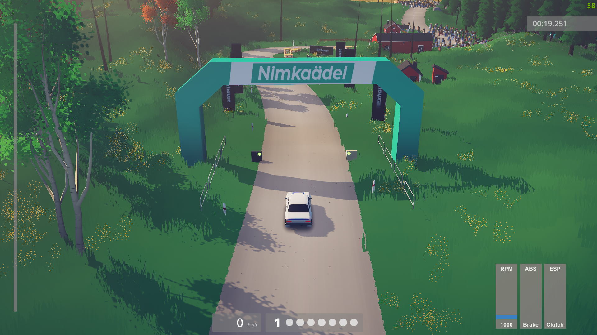

# Art Of Rally Splits

A mod for Art Of Rally that adds a more detailed HUD.

#### Launcher Support

#### Platform Support

## Usage

Press `CTRL + F10` to bring up the mod menu. Click on the Splits mod,
and enable or disable the desired features.

### What does everything mean?

* Left Slider
  * Big Bar: Throttle Input
  * Small Bar: RPM from min to max (see [car stats](http://aor-preview.theaninova.de/car/stats/))
  * "P": Max Power RPM (Point at which the car reaches full power)
  * "S": Shift Up RPM (Point at which the automatic transmission will shift up)
  * Top Label: RPM
  * Bottom Label: Speed
* Middle Slider
  * Big Bar: Brake Input
  * Small Bar: Handbrake Input (Can also be analog!)
  * ABS Label: Flashes when ABS gets triggered
* Right Slider
  * Big Bar: Clutch Input (Can also be analog!)
  * ESP Label: Unused, feature is disabled in all cars

## Installation

Follow the [installation guide](https://www.nexusmods.com/site/mods/21/) of
the Unity Mod Manager.

Then simply download the [latest release](https://github.com/Theaninova/ArtOfRallyAdvancedHUD/releases/latest)
and drop it into the mod manager's mods page.

## Showcase

